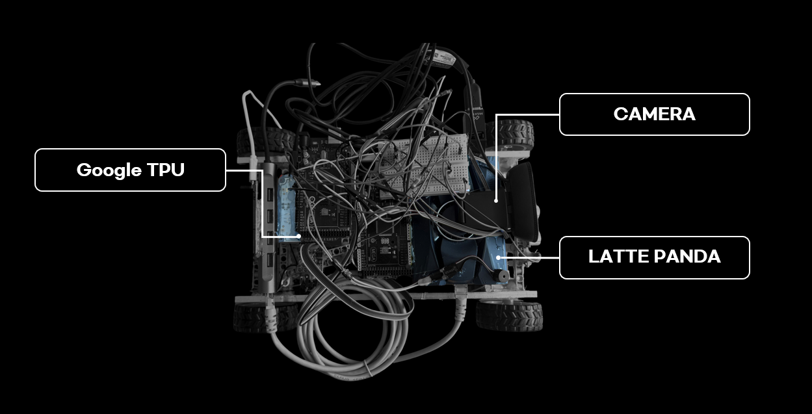
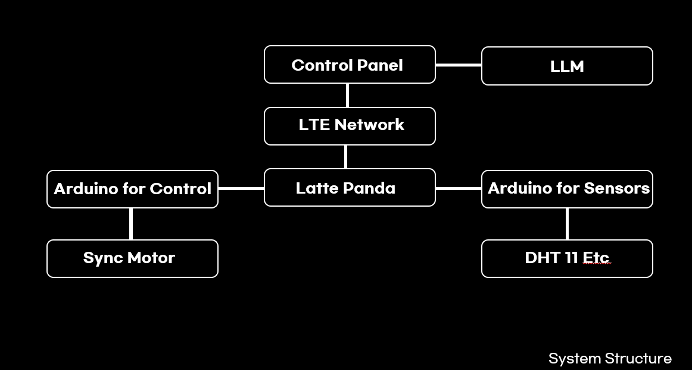

# Your Environment Project 
(Real-Time Edge AI Exploration Robot for Disaster Sites)

[한국어는 여기로!](./REAMDE-ko.md)

### Overview 
This project was created with firefighters working on fire scenes in mind,  
and was developed as an assignment for an edge computing course at the university where the developer is currently enrolled.  

### Key Features
1. AI-based inference using a fine-tuned YOLO model
2. Optimized for low-spec devices via 8-bit quantization
3. LTE-based network
4. Remote control via WS and WebRTC
5. LLM summarization

### Description
This section provides a detailed explanation of the relevant technology stack used in this project.

(YOLO-Based Fine-Tuning)  
I believe that firefighters, who risk their lives to save others, are the people most at risk at fire scenes.  
They save people while risking their own lives, relying only on thin protective gear, but at such disaster sites, it is often impossible to know what conditions are like inside the fire. Therefore, when this robot is deployed, we aimed to quickly provide firefighters with various pieces of information about the fire scene by utilizing data detected by the robot’s various sensors (water level sensor, temperature sensors (5 units, DHT11), gas sensor, motion detection sensor, ultrasonic sensor, camera) and the AI segmentation model YOLO.  

(Configuration for running on low-spec devices via 8-bit quantization)  
What I realized while working on this project is that Edge-AI is unforgiving.  
This is because, even on a low-spec device like the LattePanda Alpha, running the latest YOLO26 without fine-tuning often resulted in stuttering performance, frequently dropping to just 15 frames per second.  

Since this project is intended for firefighters and would be meaningless if not real-time I implemented OpenVino-based 8-bit quantization to accelerate processing using the built-in i615 GPU, achieving a frame rate of 45–60 frames per second.  

I initially tried to make the most of the Coral module I had on hand, but since the results were worse than expected, I ended up removing some of it in the final version.  

(LTE-based network)  
The reason for choosing an LTE-based network is simple: at a fire scene, we cannot rely on Wi-Fi, Wi-Fi Direct, Bluetooth, or UWB (Ultra Wide Band).  
I learned through my research that fires can emit large amounts of radio waves, which significantly impair signal stability and integrity.  

Simply put, it’s a matter of frequency interference, and the quickest way to solve this was to transmit high-power radio waves, just like LTE does.  

Accordingly, to use the LTE network, I connected my smartphone via a USB-C hub and tethering to provide internet access to the LattePanda via an RJ45 connection for remote control.  

P.S. While working on this, **2.3 GB** of precious data melted away during a demo. T_T  

(WS, WebRTC-based control)  
Actually, this part ended up being implemented differently as I worked on it. 
Originally, I had planned to use plain HTTP communication. 
However, as mentioned earlier, the LattePanda lacked the capacity to handle this level of data traffic, and as a result, the plain HTTP method caused significant delays (4 seconds or more) in operation.  

Based on my debugging, the problem occurred when the socket reconnected.
Under normal circumstances, this shouldn’t be a problem, but since the device was operating at 99–100% CPU utilization, it was causing delays.  

So, I maintained a constant connection via WebSocket.  

WebRTC was implemented for a simple reason: to retrieve sensor data from the robot remotely and verify the segmented data.  

(LLM Summary)  
This is the real highlight the reason for collecting sensor data.  
At the end, based on the collected data, we sent a command to Claude Code in the format `claude -p`, implementing the solution using our existing subscription plan without the need for separate API integration.  

We ruled out CloudFlare AI because its inference speed was too slow.

As we were working on this, we discovered though we’re not sure why that the gas sensor would occasionally “die” (…). More specifically, it would detect gas even when there was none, and it was difficult to tell whether this was accurate or not (since it’s a lab, there might actually be gas present).  

The distance sensor was acting up, but since there was fire data and no smoke, it recognized the situation that way.  

Personally, I found this to be an interesting project.

English is not my native language, so I used a translator; the wording might sound a bit awkward.  

### Main Structure
